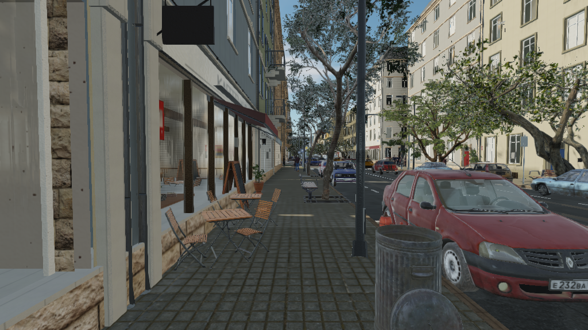

# cna-street

A procedural city street rendered with [CNA](https://github.com/openeggbert/cna).
It has a working junction, traffic, pedestrians, shops, trees, an analytic sky,
local reflection probes and spatial audio. Geometry and signage are generated
from a seed; optional scanned surfaces and imported models add detail.



## Build

You need a C++23 compiler, CMake 3.23 or later and Ninja. CNA and its
sharp-runtime, easy-gl and meta-gl dependencies are sibling checkouts:

```text
parent/
├── cna-street/
├── cna/             next branch
├── sharp-runtime/   next branch
├── easy-gl/         develop branch
└── meta-gl/         develop branch
```

`scripts/fetch-dependencies.sh` obtains them for a fresh checkout. Use
`--pinned` to check out the revisions in `dependencies.lock`. Existing
checkouts can be selected with `CNA_ROOT_DIR` and
`CNA_SHARP_RUNTIME_ROOT` during CMake configuration.

```sh
cmake -S . -B build -G Ninja -DCMAKE_BUILD_TYPE=Release
cmake --build build --parallel
ctest --test-dir build --output-on-failure
```

The default renderer is `OPENGL33`. `CNA_STREET_RENDERER` sets the build's
default renderer; `CNA_GRAPHICS_RENDERERS` can compile several. The build enables
the CNA graphics extensions used by the application. See
[the development guide](docs/DEVELOPING.md) for source layout, renderer
selection and day-to-day checks.

## Run

```sh
./build/bin/cna-street
./build/bin/cna-street --help
```

WASD moves, the mouse looks around, Q/E moves vertically, Tab switches between
walking and flying, and F1 toggles the diagnostics panel. F5 toggles fog, F6
clouds and F9 captures a screenshot. `--night` starts at civil twilight.
`--preset low|medium|high|ultra` changes quality settings; `--settings <file>`
loads a JSON settings file, and `--dump-settings` prints the effective values.
The default file is `assets/config/render.json`.

For an offscreen capture on a system with SDL's offscreen GL driver:

```sh
SDL_VIDEODRIVER=offscreen ./build/bin/cna-street \
  --no-audio --screenshot /tmp/cna-street.png
```

`--capture <dir>` writes all named viewpoints. `--benchmark-list` lists fixed
benchmark cameras and `--benchmark <name>` runs one. The full command line is
shown by `--help`.

## Assets

The application runs with generated assets alone. Optional scanned surfaces and
models are declared in `assets/external/manifest.json`, with sources, licences
and checksums. `scripts/fetch-assets.sh` downloads files with public URLs;
`scripts/prepare-audio.py` derives the separately obtained sound samples.
`python3 scripts/validate-assets.py` verifies the manifest and any files
already present. [Attribution](assets/ATTRIBUTION.md) records their provenance.

`cmake --build build --target content` bakes and compiles generated content. The
application can generate surfaces at startup when that content is absent.

## Tests and screenshots

`ctest --test-dir build --output-on-failure` runs the C++ tests and available
asset checks. `scripts/check-screenshots.sh` renders 18 fixed viewpoints and
compares them with [reference screenshots](docs/screenshots/). Run it when
changing rendering, geometry or scene composition. It needs `compare-images`
and a GL display; see the [development guide](docs/DEVELOPING.md) before
updating reference images.

## Project layout

| Path | Contents |
| --- | --- |
| `street/` | Application, C++ library and shaders |
| `tests/` | CTest executables |
| `tools/` | Content baker and screenshot comparator |
| `scripts/` | Dependency, asset, content and benchmark workflows |
| `assets/` | Configuration, manifests and attribution |
| `docs/DEVELOPING.md` | Working guide for C++ changes |
| `docs/screenshots/` | Visual regression references |

## Licence

MIT; see [LICENSE](LICENSE). External assets have their own licences in
[assets/ATTRIBUTION.md](assets/ATTRIBUTION.md).
